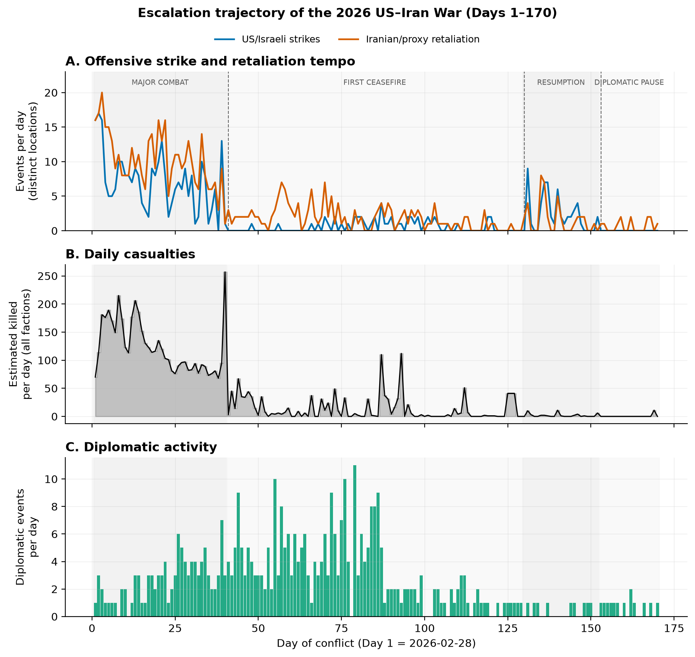
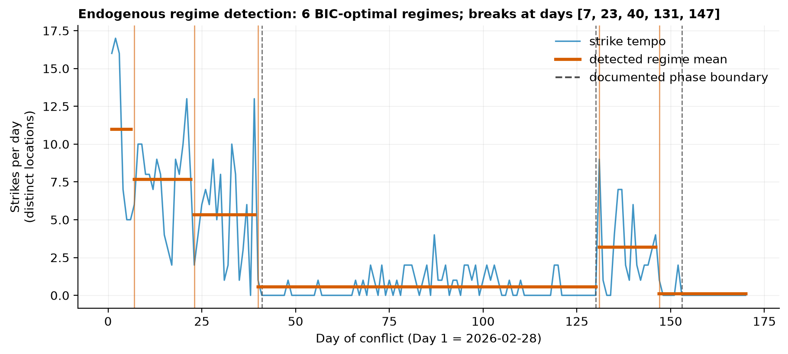
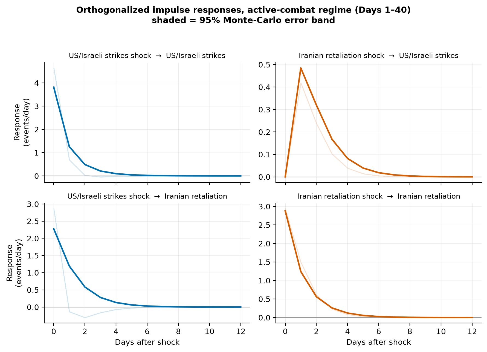
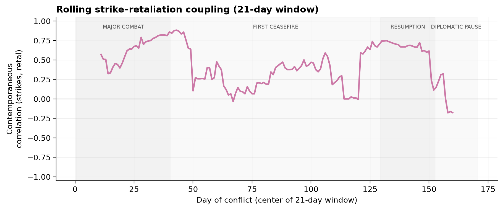
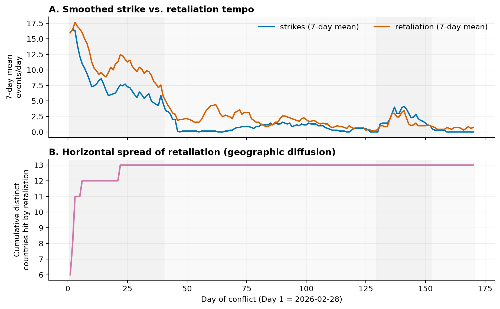
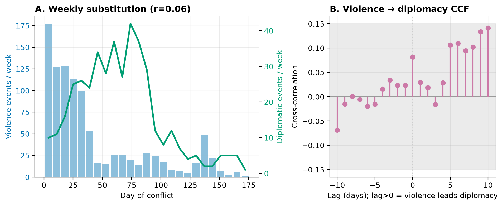

# Reciprocity Without a Lag: Contemporaneous Coupling and Regime-Contingent Escalation in the 2026 US–Iran War

**Working paper — Paper 1 of the IranWar.ai research-agenda series**

*Prepared from the IranWar.ai Event-Level Research Dataset, v1.2 (Days 1–170; 2026-02-28 to 2026-08-16).*
All results are reproducible from the scripts in `ResearchData/Paper1/src/` (see the Reproducibility section).

---

## Abstract

Classical models of interstate escalation — the conflict spiral, the escalation ladder,
and tit-for-tat reciprocity — predict that adversaries respond to one another's violence
with a measurable lag, producing a self-reinforcing action–reaction sequence. We test these
predictions against 170 days of daily strike and retaliation tempo from the 2026 US–Iran war
(Operation Epic Fury), the first sustained interstate air war for which openly available,
event-level data exist in near real time. Using vector autoregression, Granger-causality
tests, orthogonalized impulse responses, Bai–Perron structural-break detection, and
negative-binomial count models, we report four findings. First, reciprocity in this war is
**contemporaneous, not lagged**: strike and retaliation intensity are strongly correlated
within the same day (r = 0.69 during active combat, 0.83 over the full war), but every
information criterion selects a *zero*-lag model in open combat and no daily-lag Granger
causality is present — the action–reaction cycle runs faster than the one-day sampling
resolution. Second, this coupling is **regime-contingent**: it is strong during major combat,
statistically collapses during the first ceasefire (r = 0.18, n.s.), and returns when the
ceasefire breaks down (r = 0.66); the combat-vs-ceasefire difference is significant
(Fisher z, p = 0.0007). Third, the July re-escalation was **reactive**: during the resumption
phase, and over the full sample, Iranian retaliation Granger-*causes* subsequent US strikes
(p = 0.03 and p < 0.001) while the reverse does not hold — a compellence-consistent pattern
that is absent from the initial, punishment-style combat. Fourth, the **strike/retaliation
ratio flips** across regimes, from 0.68 (Iran over-responds early) to 1.42 (Iran under-responds
at resumption), a signature consistent with Iranian capability depletion. We show that "who
sets the tempo" in open combat is *under-identified* at daily resolution — a methodological
result in its own right — and that directional inference must therefore rest on the
ordering-free lagged evidence. Escalation in this conflict was less a slow-building spiral
than a fast, tightly-coupled exchange whose very existence switched on and off with the
political regime.

**Keywords:** escalation, reciprocity, conflict spiral, compellence, vector autoregression,
structural breaks, US–Iran, event data, OSINT

---

## 1. Introduction

Does violence beget violence on a schedule we can measure? The question is foundational to
the study of international conflict. Richardson's (1960) arms-race equations, Jervis's (1976)
spiral model, Kahn's (1965) escalation ladder, and Axelrod's (1984) tit-for-tat all share a
common empirical implication: adversaries reciprocate one another's hostile actions with a
characteristic lag, so that one side's escalation today predicts the other's escalation
tomorrow. A large event-data literature has sought that lag in interstate interaction, with
mixed and often modest results (Goldstein 1991; Goldstein and Freeman 1990; Ward 1982; Dixon
1986; Moore 1995). Most of that work rests on conflicts observed retrospectively, coded from
news archives months or years after the fact, and aggregated to weekly, monthly, or event-
dyad units that may be coarser than the dynamics they seek to capture.

The 2026 US–Iran war (Operation Epic Fury) offers an unusual test case. It is the first
sustained interstate air war of the generative-AI era to be tracked, at daily resolution and
in the open, from its opening hours (Thomas et al. 2026). The IranWar.ai event dataset records
each reported strike, retaliation, casualty estimate, naval movement, and diplomatic
development as a discrete, source-attributed, confidence-scored observation. Its v1.2 release
covers 170 days — long enough to estimate the time-series models the escalation literature
demands, and long enough to span not one conflict episode but four: an opening phase of major
combat, a negotiated ceasefire, a violent resumption, and a second diplomatic pause. That
regime structure is not a nuisance to be differenced away. It is a natural experiment in
whether the mechanics of reciprocity are a fixed property of a hostile dyad or a contingent
feature of a particular political moment.

We ask four questions, drawn directly from the escalation and coercion literatures and from
the research agenda set out in the dataset's descriptor paper (Thomas et al. 2026, §7.1):

1. **Reciprocity.** Does US/Israeli strike intensity predict Iranian retaliation, and vice
   versa, at a measurable daily lag (tit-for-tat), or is the relationship contemporaneous?
2. **Coercive logic.** Does the strike campaign follow a *punishment* logic — proceeding on
   its own tempo regardless of Iranian behavior — or a *compellence* logic, reacting to
   Iranian moves (Schelling 1966)?
3. **Regime-dependence.** Is the reciprocal relationship stable across the war, or does it
   change across the combat / ceasefire / resumption / pause regimes?
4. **Asymmetry.** Is escalation symmetric, or does one side set the tempo — and does the
   answer change as the war grinds on?

Our answers reframe the classical picture. The war is unmistakably reciprocal — but the
reciprocity is *contemporaneous*, occurring within the daily resolution rather than across it,
so that the lagged tit-for-tat sought by fifty years of event-data research is simply absent
in open combat. The coupling is *regime-contingent*, switching off during the ceasefire and
back on at the resumption. And where a daily direction *is* identifiable — in the reactive
July re-escalation — it runs from Iranian retaliation to subsequent US strikes, not the
reverse. We also show, as a methodological caution, that the intuitive question "who drove the
escalation in open combat?" is not identified from daily data when the coupling is
contemporaneous: any answer is an artifact of the analyst's ordering assumption.

---

## 2. Theory and hypotheses

**The spiral and the ladder.** The spiral model (Jervis 1976; Glaser 1997) holds that
security-seeking adversaries interpret each other's actions as hostile and reciprocate,
generating self-reinforcing escalation. Kahn's (1965) ladder formalizes escalation as movement
across discrete thresholds. Both imply that escalation is *cumulative and directional*: once
begun, it climbs. Richardson's (1960) reaction equations give the spiral its canonical
functional form — each side's armament (here, violence) responds positively to the other's,
with a lag. This yields:

> **H1 (lagged reciprocity).** Yesterday's strikes predict today's retaliation, and yesterday's
> retaliation predicts today's strikes (bidirectional Granger causality at a daily lag).

**Punishment vs. compellence.** Schelling's (1966) distinction between *deterrence/punishment*
(degrading or hurting the adversary irrespective of its immediate behavior) and *compellence*
(coercing a change in behavior, and therefore *responsive* to that behavior) implies competing
signatures in the data. A punishment campaign sets its own tempo: strikes are (Granger-)
exogenous to enemy retaliation. A compellence campaign is reactive: strikes respond to what
the adversary does.

> **H2 (coercive logic).** Under punishment, retaliation does not Granger-cause strikes; under
> compellence, it does.

**Audience costs and commitment.** Fearon's (1994, 1995) audience-cost and rationalist
frameworks predict that public commitments (ultimatums, red lines) and the credibility of
threats shape escalation. We do not have leader-level signaling data at daily resolution, but
the regime transitions — a ceasefire, its collapse, a pause — are exactly the junctures at
which commitment dynamics should be visible in the tempo data.

> **H3 (regime-dependence).** The strength and/or direction of the strike–retaliation relation
> differs across the war's regimes.

**Asymmetry and depletion.** Bargaining models treat fighting as costly signaling about
private information, including military capability (Fearon 1995; Powell 2006; Slantchev 2003).
If one belligerent's capacity to respond degrades over time, the ratio of its actions to the
adversary's should fall — an observable footprint of depletion.

> **H4 (asymmetry).** The strike/retaliation ratio is not constant; a rising ratio indicates
> declining relative Iranian response capacity.

---

## 3. Data and measures

**Source.** All series are built from the IranWar.ai Event-Level Research Dataset v1.2 (Thomas
et al. 2026), pinned to the frozen `releases/v1.2/` snapshot for exact reproducibility. The
dataset contains 4,612 event-level observations across nine domains; we use the STRIKE,
RETALIATION, DIPLOMATIC, and casualty records. Day 1 = 2026-02-28.

**Intensity measures.** Our primary daily measures are *tempo* counts that de-duplicate the
dataset's target-level "explosion": for each day we count the number of **distinct offensive
locations struck** (US/Israeli `strikes`) and **distinct retaliation events** (`retal`),
adding discrete offensive/retaliatory timeline events. Because operationalization is itself an
interpretive choice, we replicate every core result under two alternatives — raw event-rows
(which include the target explosion) and timeline-only discrete events — in §6. The measures
are highly concordant (the primary and raw-row strike series correlate 0.92).

**Casualties and diplomacy.** `killed` is the summed daily estimated fatalities across the
five tracked factions; `diplomatic` is the daily count of DIPLOMATIC-domain events. Both carry
the dataset's documented limitations (interpolation, contested counts, reporting lag), which we
treat as substantive, not merely technical (Thomas et al. 2026, §5–6).

**Panel.** The analysis panel is 170 daily observations (Day 1–170). Totals over the window:
386 strike-location-days, 621 retaliation events, 6,213 estimated killed, and 414 diplomatic
events. Table 1 (`t01_phase_intensity.csv`) reports per-phase intensities; the four phases —
**Major Combat** (Days 1–40), **First Ceasefire** (41–129), **Resumption** (130–152), and
**Diplomatic Pause** (153–170) — are taken from the project's phase narrative and are
*recovered endogenously* in §5.2.

| Phase | Days | Strikes/day | Retal/day | Killed/day | Diplomatic/day | Strike:Retal |
|---|---|---|---|---|---|---|
| Major Combat | 1–40 | 7.02 | 10.30 | 123.6 | 2.62 | 0.68 |
| First Ceasefire | 41–129 | 0.57 | 1.79 | 13.7 | 3.22 | 0.32 |
| Resumption | 130–152 | 2.35 | 1.65 | 1.9 | 0.39 | 1.42 |
| Diplomatic Pause | 153–170 | 0.00 | 0.67 | 0.6 | 0.72 | 0.00 |

*Table 1. Daily intensities by phase.* Figure 1 plots the full trajectory.

*Figure 1. Escalation trajectory. (A) Daily US/Israeli strike and Iranian/proxy retaliation
tempo; (B) daily estimated killed; (C) daily diplomatic activity. Shaded bands mark the four
regimes.*

---

## 4. Methods

We model the bivariate daily series **[strikes, retal]** with a vector autoregression (VAR;
Sims 1980; Brandt and Williams 2007), the standard tool for reciprocal dynamics in political
event data. Lag order is chosen by AIC (BIC, HQIC, FPE reported). We test **Granger causality**
(Granger 1969) in both directions, trace **orthogonalized impulse-response functions** with
seeded Monte-Carlo 95% error bands, and compute **forecast-error variance decompositions**
(FEVD). Because the same-day correlation is high, we report the FEVD under *both* Cholesky
orderings and treat any ordering-*dependent* asymmetry as unidentified.

Stationarity is assessed with ADF and KPSS tests (§5.1). Regimes are recovered endogenously
with a least-squares multiple-break (Bai–Perron 1998, 2003) model of the mean, selecting the
number of breaks by BIC (§5.2). Regime-dependence is tested by estimating the coupling within
each phase and comparing correlations with a Fisher r-to-z test (§5.4). All count-based results
are re-estimated with negative-binomial distributed-lag models to guard against the Gaussian-VAR
approximation for overdispersed counts (§6).

---

## 5. Results

### 5.1 The series are stationary within combat but broken across the war

ADF strongly rejects a unit root for both strike and retaliation tempo *within* the combat
regime (p = 0.0002 and 0.010; `t02_stationarity.csv`). Over the full 170 days, KPSS rejects
stationarity for every series — but this reflects the ceasefire-era **mean shift**, a
structural break rather than a unit root, confirmed in §5.2. We therefore estimate the primary
reciprocity model on the combat regime, where the series are well-behaved, and report the
full-sample VAR as a war-average with the break made explicit.

### 5.2 The regimes are real: endogenous break detection

A Bai–Perron mean-shift model selects, by BIC, six regimes in the strike-tempo series with
breaks at **Days 7, 23, 40, 131, and 147** (`t04_breakpoints.csv`, Figure 4). The three
macro-transitions the project documents from narrative sources — the end of heavy strikes
(Day 41), the ceasefire's collapse (Day 130), and the second pause (Day 153) — are recovered
to within **1, 1, and 6 days** respectively, *without the algorithm being told where to look*.
The two additional breaks (Days 7, 23) subdivide the opening combat phase into descending
intensity tiers, an escalation-ladder signature: the heaviest tempo is front-loaded into the
first week and steps down thereafter.

*Figure 4. Endogenous regime detection. BIC-optimal regime means (orange) over the strike-tempo
series; dashed lines mark independently documented phase boundaries.*

### 5.3 Reciprocity is contemporaneous, not lagged (H1 rejected as stated)

Within the combat regime, strike and retaliation tempo are strongly correlated **on the same
day** (Pearson r = 0.687, p < 10⁻⁶; `t03_contemporaneous.csv`). Yet every information criterion
— AIC, BIC, HQIC, FPE — selects a **zero-lag** VAR, and neither Granger direction is significant
(strikes→retal p = 0.78; retal→strikes p = 0.44; `t03_granger.csv`). In the VAR(1) reported for
completeness, the only significant dynamic term is retaliation's own persistence (0.43,
p = 0.04); the residual correlation is 0.62. In other words, the action and the reaction occur
*within* the same 24-hour bin. The lagged tit-for-tat that H1 predicts — and that a large
event-data literature has sought — is not merely weak here; at daily resolution during open
combat it is **absent**, because the exchange is faster than the data.

The impulse responses (Figure 3) make the structure concrete: a one-standard-deviation strike
shock is accompanied by ≈ 2.3 additional retaliation events *the same day* and ≈ 4.6 cumulatively
over a week; the responses decay within four to five days. This is a tightly-coupled,
fast-relaxing exchange, not a slow climbing spiral.

*Figure 3. Orthogonalized impulse responses, combat regime. Shaded bands are 95% Monte-Carlo
intervals. The dominant responses are on impact (day 0).*

### 5.4 The coupling is regime-contingent (H3 supported)

The same-day coupling is not a fixed property of the dyad. It is strong in major combat
(r = 0.69), **statistically collapses during the first ceasefire** (r = 0.18, p = 0.10 —
indistinguishable from zero), and **returns at the resumption** (r = 0.66, p < 0.001;
`t05_regime_reciprocity.csv`). A Fisher r-to-z test rejects equality of the combat and
ceasefire couplings (z = 3.37, p = 0.0007). Figure 5 shows the transition directly: the rolling
21-day correlation sits near 0.8 in combat, falls into a noisy band around 0.1–0.4 through the
ceasefire, and climbs back above 0.7 when fighting resumes. Reciprocity, in this war, is
something the belligerents *switch on and off* with the political regime — not a mechanical
constant.

*Figure 5. Rolling 21-day strike–retaliation correlation. The coupling is regime-contingent.*

### 5.5 Re-escalation was reactive: retaliation leads strikes (H2)

Where a daily *direction* is identifiable, it is informative. Over the full sample, Iranian
retaliation Granger-causes subsequent US strikes (F = 4.05, p = 0.0001) while strikes do **not**
Granger-cause retaliation (p = 0.33). §5.4 localizes this asymmetry: it is a feature of the
**resumption** phase, where retaliation→strikes is significant (p = 0.03) and the lead–lag
cross-correlation is strongly asymmetric (retaliation leads strikes by one day at 0.45, versus
−0.06 the other way; `t05_asymmetry.csv`), whereas in the initial combat the lead–lag structure
is symmetric (0.33 vs 0.32). The substantive reading is that the **July re-escalation was
reactive** — US strikes followed Iranian provocations (maritime attacks, cross-border fire)
into a renewed campaign — a *compellence*-consistent pattern (H2), in contrast to the
punishment-style, self-paced opening campaign. Because this evidence is *lagged*, it does not
depend on any contemporaneous ordering assumption (§5.7).

### 5.6 Escalation asymmetry and Iranian depletion (H4 supported)

The strike/retaliation ratio is far from constant (Table 1). It rises monotonically across the
active regimes — 0.68 in major combat, when Iranian retaliation actually *out-paces* recorded
strikes, to **1.42 at the resumption**, when US strikes outnumber Iranian responses by nearly
three to two, before violence ceases in the pause. The geographic spread of retaliation tells
the same story of an early peak and later exhaustion: Iranian and proxy retaliation reached 13
distinct countries by **Day 22** and opened no new fronts thereafter (Figure 2B). A war that
Iran met blow-for-blow in March it could only answer at a discount by July — a footprint
consistent with capability depletion (H4) and with the bargaining-model logic that fighting
gradually reveals private information about capacity (Fearon 1995; Slantchev 2003).

*Figure 2. (A) Smoothed strike and retaliation tempo; (B) cumulative distinct countries hit by
retaliation — horizontal diffusion saturates by Day 22.*

### 5.7 "Who set the tempo?" is under-identified at daily resolution

It is tempting to ask which side *drove* the same-day exchange in open combat. The FEVD appears
to answer: under a strikes-first ordering, US strikes explain 41% of retaliation's forecast-
error variance while retaliation explains only 2% of strikes'. But this asymmetry **reverses
completely** under the opposite ordering, where retaliation explains 44% of strikes' variance
and strikes only 0.2% of retaliation's (`t03_fevd.csv`). Because the coupling is contemporaneous
and strong, the Cholesky decomposition simply attributes the shared same-day variance to
whichever series is ordered first. The honest conclusion is that **the direction of the
contemporaneous exchange is not identified from daily data**. This is not a failure of the data
but a property of the phenomenon: the reaction is faster than the sampling interval. Directional
claims in this paper therefore rest exclusively on the *lagged* evidence of §5.5, which is
ordering-free.

---

## 6. Robustness

**Operationalization.** The contemporaneous coupling is positive and significant under all
three intensity measures — combat r = 0.69 (primary), 0.62 (raw event-rows), 0.34 (timeline-only
discrete events); full-sample r = 0.83 / 0.80 / 0.35 (`t06_operationalization.csv`). The
timeline-only series is sparser and noisier but still significant, so the finding is not an
artifact of the target-explosion in the strike files.

**Count models.** Negative-binomial distributed-lag models of daily retaliation on
contemporaneous and lagged strikes reproduce the picture: over the full sample, same-day strikes
(IRR = 1.14, p < 0.001) and retaliation's own lag (IRR = 1.17, p < 0.001) predict retaliation,
while within combat the daily-lag structure is weak (`t06_countmodel_retal.csv`), consistent
with contemporaneous-dominated coupling.

**Casualty propagation.** Daily fatalities do **not** track daily strike or retaliation tempo
within combat (all lags n.s.; `t06_casualty_propagation.csv`). This is an honest negative:
casualties in this dataset are driven by discrete mass-casualty events and by reporting lags,
not by strike *counts* — exactly the limitation the dataset documents for its casualty fields.
Analysts should not use event tempo as a proxy for lethality.

---

## 7. Diplomacy and violence

Do negotiations track the battlefield? At the regime level, yes: diplomatic activity is highest
during the ceasefire (3.2 events/day) and **collapses at the resumption** (0.4/day, present on
only 39% of days), when both the ceasefire and the diplomatic channel broke together
(`t07_diplomacy_phase.csv`). But at daily and weekly frequency the two tracks are **decoupled**:
weekly violence and weekly diplomacy are uncorrelated (r = 0.06, n.s.), and neither Granger-
causes the other (`t07_granger_diplo.csv`). Diplomacy and fighting ran on parallel tracks —
belligerents talked while they fought (2.6–3.2 diplomatic events/day right through combat) —
and the tracks shifted together at regime boundaries rather than trading off tactically day to
day (Figure 6). This is consistent with a bargaining view in which fighting and negotiating are
simultaneous instruments, and it cautions against reading any single strike as a coercive-
diplomatic "signal."

*Figure 6. (A) Weekly violence (bars) and diplomacy (line); (B) violence→diplomacy cross-
correlation — within the significance band at all leads and lags.*

---

## 8. Discussion

Three implications follow for the study of escalation.

**Resolution matters.** The lagged tit-for-tat that dominates the theoretical imagination is,
in this high-tempo air war, an artifact of coarse sampling. At daily resolution the reciprocity
is contemporaneous; a weekly or monthly dataset would have shown a lag that is really just
within-bin exchange smeared across the bin. As real-time, high-frequency conflict data become
available (Thomas et al. 2026), the field should expect the *timescale* of reciprocity to become
an object of study, not an assumption. Reciprocity here operates below the one-day floor of even
this unusually granular dataset.

**Reciprocity is a regime, not a constant.** The coupling switched off during the ceasefire and
back on at the resumption. Models that treat action–reaction parameters as fixed dyadic
constants will misfit conflicts that move between negotiated pauses and renewed fighting. The
interesting quantity is not "the" reaction coefficient but the conditions under which reciprocity
is switched on — precisely the commitment and audience-cost dynamics that Fearon's framework
foregrounds and that the regime transitions here render observable.

**Punishment then compellence.** The opening campaign was self-paced (punishment): US strikes
were not daily-predictable from Iranian behavior, and the exchange was symmetric. The July
re-escalation was reactive (compellence): retaliation led strikes. The same dyad ran different
coercive logics in different regimes — a within-case contrast that cross-sectional designs
cannot see. And across the whole war, the rising strike/retaliation ratio and the early
saturation of Iran's geographic reach trace a familiar arc of attritional depletion.

These findings should be read against the dataset's own epistemics (Thomas et al. 2026, §5–6).
The record is OSINT: strike and casualty reports carry strategic framing, some retaliation
records are unverified, and casualty counts are contested. We have treated those features as
boundary conditions — e.g., resting no argument on casualty *tempo* (§6) — rather than as
resolved facts.

---

## 9. Limitations

1. **OSINT, not ground truth.** Event counts reflect what was *reported*. Systematic under- or
   over-reporting by any party would bias the tempo series; source-disaggregated replication
   (coding the same events as CENTCOM, ACLED, and Iranian sources would) is a natural extension
   the dataset's record-level source attribution supports.
2. **The explosion caveat.** Strike tempo partly reflects the dataset's target×active-day
   expansion. We de-duplicate to distinct locations and replicate on timeline-only events (§6),
   but a purpose-built sortie count would be preferable.
3. **Sub-daily dynamics are invisible.** Our central finding — contemporaneous coupling — is
   also a limitation: we cannot resolve the within-day ordering of strikes and retaliations. The
   directional question in open combat is under-identified (§5.7).
4. **Casualty and diplomacy fields are coarse.** Fatalities are lagged and contested; diplomatic
   "events" are heterogeneous. We use them for regime-level description, not fine causal claims.
5. **One war, four regimes.** These are within-case regularities from a single conflict. They
   are hypotheses for comparative testing, not established generalizations.

---

## 10. Conclusion

Across 170 days, the 2026 US–Iran war was reciprocal but not in the way the classical models
say. Strikes and retaliation moved together within the day, not across it; their coupling
switched on in combat, off in the ceasefire, and on again at the collapse; the re-escalation was
reactive where the opening was self-paced; and Iran's declining relative response marked its
attrition. Escalation here was less a ladder climbed rung by rung than a fast exchange whose
existence was governed by the political regime around it. The result is a caution and an
invitation: a caution that the timescale and the regime are part of what we are trying to
explain, and an invitation to test these patterns against the next high-frequency conflict record
— which, for the first time, we may have before the war is over.

---

## Reproducibility

Every number, table, and figure in this paper is regenerated from the frozen v1.2 dataset by the
scripts in `ResearchData/Paper1/src/` via `bash run_all.sh` (≈ one minute). Series construction
is documented in `docs/CODEBOOK_panel.md`; modeling choices in `docs/METHODS.md`. The analysis is
pinned to `ResearchData/releases/v1.2/`, so it reproduces regardless of later dataset releases.

## Data availability

IranWar.ai Event-Level Research Dataset v1.2, `github.com/jethomasphd/WarTheater`
(`ResearchData/releases/v1.2/`).

## Suggested citation

> IranWar.ai Research Agenda, Paper 1 (2026). *Reciprocity Without a Lag: Contemporaneous
> Coupling and Regime-Contingent Escalation in the 2026 US–Iran War.* Analysis of the IranWar.ai
> Event-Level Research Dataset v1.2. github.com/jethomasphd/WarTheater.

---

## References

Axelrod, R. (1984). *The Evolution of Cooperation.* Basic Books.

Bai, J., & Perron, P. (1998). Estimating and testing linear models with multiple structural
changes. *Econometrica*, 66(1), 47–78.

Bai, J., & Perron, P. (2003). Computation and analysis of multiple structural change models.
*Journal of Applied Econometrics*, 18(1), 1–22.

Brandt, P. T., & Williams, J. T. (2007). *Multiple Time Series Models.* Sage.

Dixon, W. J. (1986). Reciprocity in United States–Soviet relations. *American Journal of
Political Science*, 30(2), 421–445.

Fearon, J. D. (1994). Domestic political audiences and the escalation of international disputes.
*American Political Science Review*, 88(3), 577–592.

Fearon, J. D. (1995). Rationalist explanations for war. *International Organization*, 49(3),
379–414.

Glaser, C. L. (1997). The security dilemma revisited. *World Politics*, 50(1), 171–201.

Goldstein, J. S. (1991). Reciprocity in superpower relations: An empirical analysis.
*International Studies Quarterly*, 35(2), 195–209.

Goldstein, J. S., & Freeman, J. R. (1990). *Three-Way Street: Strategic Reciprocity in World
Politics.* University of Chicago Press.

Granger, C. W. J. (1969). Investigating causal relations by econometric models and cross-spectral
methods. *Econometrica*, 37(3), 424–438.

Jervis, R. (1976). *Perception and Misperception in International Politics.* Princeton
University Press.

Kahn, H. (1965). *On Escalation: Metaphors and Scenarios.* Praeger.

Moore, W. H. (1995). Action–reaction or rational expectations? Reciprocity and the domestic–
international conflict nexus. *Journal of Conflict Resolution*, 39(1), 129–167.

Powell, R. (2006). War as a commitment problem. *International Organization*, 60(1), 169–203.

Raleigh, C., Linke, A., Hegre, H., & Karlsen, J. (2010). Introducing ACLED. *Journal of Peace
Research*, 47(5), 651–660.

Richardson, L. F. (1960). *Arms and Insecurity.* Boxwood Press.

Schelling, T. C. (1966). *Arms and Influence.* Yale University Press.

Sims, C. A. (1980). Macroeconomics and reality. *Econometrica*, 48(1), 1–48.

Slantchev, B. L. (2003). The principle of convergence in wartime negotiations. *American
Political Science Review*, 97(4), 621–632.

Thomas, J. E., Alpysbekova, A., Osei Mensah, E., Masara, N., & Sharma, P. (2026). IranWar.ai:
An open-source event-level dataset of the 2026 US–Iran conflict. Preprint / dataset descriptor,
github.com/jethomasphd/WarTheater.

Ward, M. D. (1982). Research gaps in alliance dynamics. *International Studies Quarterly*, 26(1),
95–125.

Weidmann, N. B. (2015). On the accuracy of media-based conflict event data. *Journal of Conflict
Resolution*, 59(6), 1129–1149.

Zartman, I. W. (2000). Ripeness: The hurting stalemate and beyond. In P. Stern & D. Druckman
(Eds.), *International Conflict Resolution After the Cold War.* National Academies Press.
