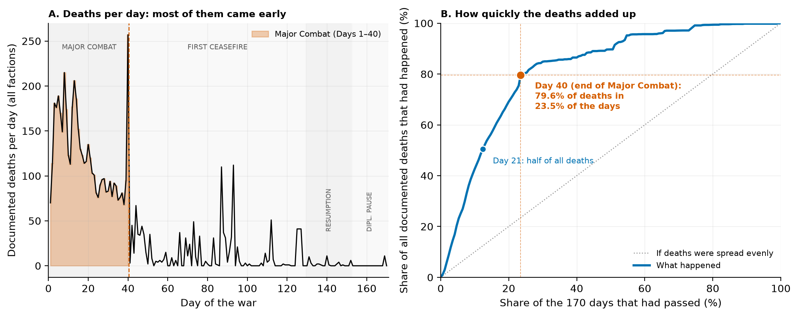
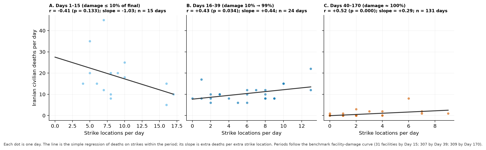
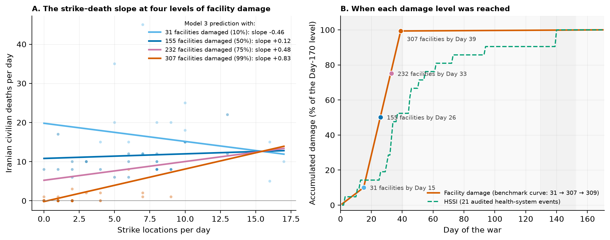
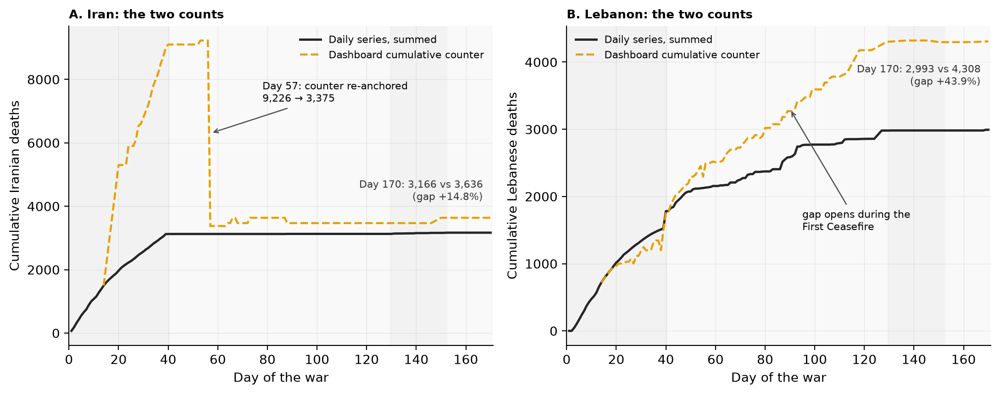
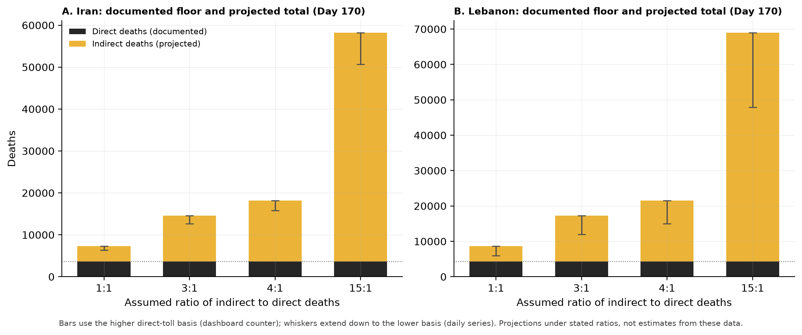

# Killed Early, Left Fragile, Counted Short: Civilian Deaths and Health-System Damage in the First 170 Days of the 2026 US–Iran War

**Working paper. Paper 2, version 3, of the IranWar.ai research-agenda series.**

*Authors: Eugene Osei Mensah (first author) and Jacob E. Thomas (senior author).*

*Data: IranWar.ai Event-Level Research Dataset, version 1.2 (Days 1–170; 28 February to 16 August 2026). Every number in this paper is regenerated from the frozen dataset by one command (see "Reproducibility"). Every table is rendered from the result files and checked against this text.*

> **Drafting note for Eugene.** Notes like this one appear throughout the draft. They tell you what each part is for, where your own writing goes, and how to say things. Delete them before submission. Confirm the author list, author order, and affiliations with Jacob.

---

## About this version

This is version 3 of Paper 2. It uses the same data and reaches the same three findings as version 2. Three things are different.

1. **Plain language.** Sentences are short. Each statistical term is defined the first time it is used and again in the glossary (Appendix A). The reader we have in mind has completed a first graduate course in statistics in a psychology, nursing, or medical program.
2. **Three tools only.** Every result comes from means comparison, correlation, or regression. Nothing else is used.
3. **The first author's review comments are built in.** The "policy window" point now opens the Introduction (Section 1.2). Section 5.3 gives the exact wording for the weaker of the two damage measures in Finding 2. Finding 3 presents the range of projections first and the 4:1 scenario as a reference point, not as the answer. Box 1 (Section 2.5) explains why the two death counts in the dataset do not match.

Two corrections to version 2 are recorded here so that nothing is hidden. First, version 2 reported the strike–death slope at "mean ± 1 SD" of facility damage. The mean plus one standard deviation is 116% of the final damage level, which is above the highest level that ever occurred (100%). Version 3 reports the slope at damage levels that did occur. The pattern is the same (the slope rises with damage), but the end values are different (version 2: 0.18 to 1.07; version 3: −0.46 to +0.83). Second, version 2 said that "the deadliest single day of the war was its first." In the daily series this is not true (the deadliest day was Day 40, with 257 deaths, most of them in Lebanon). The sentence is removed. Finally, the findings are now numbered 1, 2, and 3. In the parent paper and in version 2 they were Findings 1, 5, and 6.

---

## Abstract

**Background.** Wars cause deaths in two ways. Some people are killed directly, by the strike itself. Others die later because the systems they depend on, such as hospitals, water supply, and electricity, have been damaged. In past conflicts the second group has been three to fifteen times larger than the first. This paper follows both kinds of death through the first 170 days of the 2026 US–Iran war, using a public event-level dataset that recorded the war day by day.

**Methods.** We built a daily table (170 days) with the number of places struck each day, the number of deaths reported each day for five groups, and two measures of health-system damage: a benchmark curve of damaged health facilities (31 by Day 15, 307 by Day 39, 309 by Day 170) and a count of 21 audited health-system events. We used three tools. Means comparison (ANOVA, t-tests, effect sizes) asks when the deaths happened. Correlation asks whether strikes and deaths moved together more closely as damage grew. Regression with an interaction term tests that change formally. The number of indirect deaths cannot be observed in these data, so we apply published ratios to the documented count as a projection.

**Results.** *Finding 1.* The war killed early. Days 1–40 were 23.5% of the war but held 79.6% of the 6,213 documented deaths. Half of all deaths had happened by Day 21. Mean daily deaths were 123.6 in Days 1–40 and 13.7 in the ceasefire that followed (Hedges' g = 3.44). Phase explained 76% of the day-to-day variance in deaths (η² = 0.76). Iranian deaths per strike location fell from 15.4 to 0.7 between the opening campaign and the July resumption. *Finding 2.* As facility damage accumulated, each additional strike was associated with more Iranian civilian deaths. In Days 1–15 (damage ≤ 10% of its final level) strikes and deaths did not move together (r = −0.41, p = .133). In Days 40–170 (damage ≈ 100%) they did (r = +0.52, p < .001). In a regression with an interaction term, the strike slope rose from −0.46 deaths per strike location at 31 damaged facilities (not significant) to +0.83 at 307 (p = .011); interaction p = .006 with autocorrelation-robust standard errors. The coarser 21-event measure points the same way but its interaction is not significant (p = .32). *Finding 3.* The counted dead are a floor. The daily series records 0.11 Iranian civilian deaths per day on the 81 days without a strike, and zero in the 89-day ceasefire, so it cannot contain deaths from disrupted care. Even the direct counts disagree: the dataset's two accountings differ by 14.8% (Iran: 3,166 vs 3,636) and 43.9% (Lebanon: 2,993 vs 4,308). Applying published ratios of 3:1 to 15:1 to the documented Iranian toll gives 12,664 to 58,176 total deaths; the often-cited 4:1 ratio gives 15,830–18,180.

**Conclusions.** Most of the direct dying was over by Day 40, before the health system could adapt. After that, the system absorbed each new strike less well. The deaths that reach a count are the smaller part of the toll. Death counts from this war should be published as floors.

**Keywords:** armed conflict; civilian mortality; attacks on health care; health-system resilience; indirect mortality; water and sanitation; event data; Iran; Lebanon.

---

## 1. Introduction

### 1.1 Two kinds of war deaths

A war kills in two ways. The first is direct: a strike hits a building and people inside it die. These deaths are counted, usually on the same day, and they appear in the evening news. The second is indirect: a hospital loses its operating theatre, a water plant is destroyed, a road to the clinic is closed, and people die weeks later from conditions that would normally have been treated. These deaths are rarely counted as war deaths at all.

The second kind is usually the larger. Across conflicts studied since the 1990s, indirect deaths have exceeded direct deaths by a factor of about three to fifteen (Guha-Sapir and van Panhuis 2004; Geneva Declaration Secretariat 2008; Checchi and Roberts 2008). The reason is simple. People survive on systems, and air campaigns damage systems efficiently. Health-system resilience research names the capacities a system needs to absorb a shock and keep working (Kruk et al. 2015; Kruk et al. 2017). Sustained bombardment removes exactly those capacities.

The 2026 US–Iran war is a rare chance to watch this happen with daily data. It is the first sustained interstate air war of its size to be tracked openly, every day, at the level of individual events, from its first hours (Thomas et al. 2026). The dataset records strikes and deaths. It also records harm to the health system. Some examples, in order:

- Day 3: a Tehran hospital's IVF department destroyed by a nearby strike.
- Day 11: the ICRC assessed that 30–40% of the national grid was offline in western Iran, with hospitals running on backup generators.
- Day 33: a strike on a pharmaceutical factory killed ten nurses.
- Day 39: 307 health facilities reported damaged.
- Day 140: the intake of the Bonji desalination plant destroyed, cutting drinking water to about 10,000 people in 20 villages.
- Day 170: an Iranian Red Crescent inventory of 309 damaged health facilities, 42 damaged ambulances, and 7 evacuated hospitals.

### 1.2 Why timing matters: the policy window

The first result of this paper is about timing, and timing is the point that matters most for policy. Most of the direct dying in this war happened in its first six weeks. By Day 40, four of every five documented deaths had already occurred. For Iran, the share was 98.7%.

This has a practical meaning. Any measure meant to protect civilians, whether a ceasefire, a humanitarian corridor, a rule about targets near hospitals, or a surge of medical supplies, works only if it arrives while the dying is still happening. In this war the window for protecting civilians was measured in days, not months. A protection measure that arrived after Day 40 arrived for a different and much smaller problem.

The same timing shaped the health system's experience of the war. A mass-casualty event is handled with the staff, blood, beds, and power that are available at that moment. There is no time to call in reinforcements or reorder supplies. The health system in this war met its single largest wave of casualties in the first weeks, before any adaptation was possible, and it carried the damage from that wave into every week that followed. That is the setting for Finding 2.

> **Drafting note for Eugene.** This section carries your point from review: front-loading is not only a statistical pattern, it is a policy window. Please expand the third paragraph in your own voice. Describe what a mass-casualty surge means on a ward: what you have at that moment, what you cannot get, and how the pressure carries forward into the following shifts. Two or three short paragraphs are enough. Keep the sentences short and keep the numbers as they are.

### 1.3 What this paper does

We ask three questions and answer each with one standard tool.

1. **When did people die?** We compare mean daily deaths across the four phases of the war (means comparison). *Finding 1: the war killed early.*
2. **Did the cost of a strike change as the health system was damaged?** We first ask whether strikes and same-day deaths moved together more closely as facility damage accumulated (correlation). We then test that change formally with a regression that includes a strike × damage interaction term (regression). *Finding 2: as facility damage accumulated, each additional strike was associated with more civilian deaths.*
3. **How much of the toll do the counts miss?** We show what the daily death series can and cannot record (descriptive means comparison), show that even the direct counts are revised upward, and apply published indirect-to-direct ratios to the documented toll (arithmetic). *Finding 3: the counted dead are a floor.*

The three findings are one story told from three positions. The early wave placed the largest burden on the health system before it could adapt (Finding 1). The system then lost its ability to absorb further shocks (Finding 2). The deaths that follow from both, the indirect deaths, mostly never reach a count (Finding 3).

Two earlier results shape how we read the data. The dataset's own methods paper argues that casualty figures in this war are contested claims, not clean measurements (Thomas et al. 2026, §6.4–6.5). We therefore report every direct toll as a range, never as a single number. Paper 1 of this series found that the raw number of strikes per day is a poor guide to how many people die. We take that seriously and never rest an argument on strike counts alone.

## 2. Data

### 2.1 The dataset and the unit of analysis

All analyses use the frozen version 1.2 release of the IranWar.ai Event-Level Research Dataset (4,612 event rows; Days 0–170; Thomas et al. 2026). The release is frozen, so the paper reproduces exactly no matter how later releases change.

The unit of analysis is the **conflict-day**. There are 170 of them. Day 1 is 28 February 2026. For every day we record the number of places struck, the number of deaths reported, and the level of health-system damage. The four phases follow Paper 1: **Major Combat** (Days 1–40), **First Ceasefire** (Days 41–129), **Resumption** (Days 130–152), and **Diplomatic Pause** (Days 153–170).

### 2.2 The outcome: deaths per day

The dataset's casualty file gives an estimated number of deaths for each day and each of five groups: Iranian civilians (543 over the war), Iranian military (2,623), Lebanese, all categories (2,993), US military (20), and Israeli military (34). These are daily counts, not running totals. We call this the **daily series**. Adding the five groups gives 6,213 documented deaths.

The dashboard that produced the dataset also kept running totals, which it updated as new reports arrived. We call these the **dashboard counters**. At Day 170 the counter for Iranian deaths stood at 3,636 and the counter for Lebanese deaths at 4,308. The daily series summed over all days gives 3,166 for Iran and 2,993 for Lebanon. The two accountings therefore disagree by 14.8% (Iran) and 43.9% (Lebanon). We do not reconcile them. We carry both forward as the lower and upper bound of the direct toll, and Box 1 explains where each gap comes from.

The primary outcome for Findings 2 and 3 is **Iranian civilian deaths per day**. The primary outcome for Finding 1 is **all-faction deaths per day** (the five groups added together).

### 2.3 The exposure: strikes per day

**Strike tempo** is the number of distinct places struck by US or Israeli forces on a given day, plus discrete strike events from the timeline. A place that was struck on several days counts once on each of those days. This follows Paper 1. On average there were 7.0 strike locations per day during Major Combat, 0.6 during the First Ceasefire, 2.4 during the Resumption, and none during the Diplomatic Pause.

### 2.4 Health-system damage: two measures

We measure accumulated damage to the health system in two ways. Both run from 0 at the start of the war to 100% at Day 170.

The **facility-damage curve** is the primary measure. It is drawn through three cumulative counts of damaged health facilities that named institutions reported and that appear in the dataset: 31 by Day 15 (Iran's Health Ministry and Red Crescent reporting), 307 by Day 39 (reported through WHO and the Iranian Red Crescent), and 309 by Day 170 (Iranian Red Crescent Society). Between those points the curve is a straight line. The curve rises steeply during Major Combat and is almost flat afterwards: it reaches 10% of its final level on Day 15, 50% on Day 26, 75% on Day 33, and 99% on Day 39.

The **Health-System Stress Index (HSSI)** is the secondary measure. It is a running count of 21 audited health-system events: 6 attacks on facilities, 6 cases of harm to health workers, 6 disruptions of water or sanitation, 2 blocks on humanitarian access, and 1 disruption of medical supplies. The 21 events were found by a keyword search of the dataset and then read and corrected one by one. The full audit trail (82 screened rows, 17 documented corrections) ships with the paper in `data/health_system_events.csv`. The HSSI is a coarse measure: institutions counted more than 300 damaged facilities, and this index counts 21 events. We treat it as a check on the facility-damage curve, not as a substitute for it.

### 2.5 Box 1. Why the two death counts differ

A reader will ask why the daily series and the dashboard counter do not match. The short answer is that they are built differently, and the gap is not the same kind of gap in the two countries. Table 9 in Section 4.4 shows the numbers phase by phase.

*How they are built.* The daily series assigns deaths to the day they were reported and is not revised afterwards. The dashboard counter is a running total that was updated whenever a new cumulative figure was published, and it could be moved up or down when the dashboard switched to a different source.

*Iran: mainly a source difference.* By Day 40 the daily series had recorded 3,125 Iranian deaths. The counter stood at 9,100, because during Major Combat it tracked the high totals reported by the diaspora monitor Hengaw. On Day 57 the counter was re-anchored to the Iranian Legal Medicine Organization's forensic count (9,226 → 3,375, a drop of 63% in one day) and later moved to a verified count of 3,636. The daily series added only 41 deaths after Day 40. So the Iranian gap at Day 170 (470 deaths, 14.8%) is the difference between two sources' totals for the same early period. It is not a lag in new deaths.

*Lebanon: mainly deaths added later to a running total.* At Day 40 the two accountings agreed (1,781 vs 1,751). During the First Ceasefire the daily series added 1,200 Lebanese deaths while the Lebanese Ministry of Public Health's running total, which the counter follows, rose by 2,550. Almost the entire gap (1,320 of 1,315 at Day 170) opened in those 89 days. A ministry's running total includes deaths that are confirmed later: bodies recovered, patients who die in hospital days after an attack, and periodic revisions. The daily series records deaths reported on the day and does not go back to add them. So the Lebanese gap is mostly a difference in what gets counted after the day of the event.

*What we can and cannot say.* We can see when each gap opened and how large it is. We cannot see inside the counting processes of the sources. That is why we carry both accountings as bounds rather than choosing one.

> **Drafting note for Eugene.** Box 1 answers your question about the 14.8% and 43.9% discrepancy. In one sentence: for Iran the gap is a source difference that was settled by a re-anchoring on Day 57; for Lebanon it is a running total that kept adding confirmed deaths during the ceasefire while the daily series did not. The word "lag" is fair for Lebanon, but the fuller description is "deaths confirmed after the day of the event and added to a running total." Both gaps are structural in the sense that they come from how the two series are built.

## 3. Methods: three tools

All tests are two-sided with α = .05. Every computation is deterministic and reproduces from one command in about thirty seconds. Full variable definitions are in `docs/CODEBOOK_panel.md`; every design decision is in `docs/METHODS.md`.

### 3.1 Means comparison (Finding 1)

We compare mean deaths per day across the four phases.

- **One-way ANOVA** tests whether the four phase means differ. We report F, its degrees of freedom, and p. We also report **eta-squared (η²)**, the share of the day-to-day variance in deaths that phase explains, and omega-squared (ω²), a less biased version of the same quantity. Because the phases have very different variances, we also report Welch's ANOVA, which does not assume equal variances; it reaches the same conclusion.
- **Pairwise Welch t-tests** compare each pair of phases. There are six pairs, so we adjust the p-values with the **Holm** procedure to keep the overall false-positive rate at 5% (Holm 1979). For each pair we report the difference in means with its 95% confidence interval and **Hedges' g**, the difference in means divided by the pooled standard deviation, with a small-sample correction (Hedges 1981). By convention, g = 0.2 is small, 0.5 is medium, and 0.8 is large (Cohen 1988).
- **Deaths per strike location.** On days with at least one strike, we divide Iranian deaths (civilian plus military) by the number of strike locations. We compare Major Combat with the Resumption using a Welch t-test and Hedges' g. Because these values are skewed, we also report a rank-based test (Mann–Whitney) in the result table as a check.
- **The cumulative curve.** We order the days and record the share of all documented deaths that had already happened by each day. This gives the day on which half of the deaths had occurred, and the share that had occurred by Day 40.

### 3.2 Correlation (the bridge to Finding 2)

The **Pearson correlation** r measures how closely two variables move together on a scale from −1 to +1. We correlate strike locations per day with Iranian civilian deaths per day within three periods defined by the facility-damage curve: Days 1–15 (damage rising from 0 to 31 facilities), Days 16–39 (31 to 307), and Days 40–170 (307 to 309). Within each period we also fit a **simple regression** of deaths on strikes and report its slope: the number of extra deaths associated with one extra strike location. We compare the correlations between periods with Fisher's r-to-z test, and we repeat the analysis on strike days only and with Spearman's rank correlation as checks.

### 3.3 Regression with an interaction term (Finding 2)

We fit three regression models to the 170 days, with Iranian civilian deaths per day as the outcome.

- **Model 1:** deaths = b₀ + b₁ × strikes.
- **Model 2:** deaths = b₀ + b₁ × strikes + b₂ × damage.
- **Model 3:** deaths = b₀ + b₁ × strikes + b₂ × damage + b₃ × (strikes × damage).

In Model 3 both predictors are **mean-centered** before the product is formed. This is standard practice for interaction models: it makes b₁ the strike slope at the average damage level and keeps the product term from being highly correlated with its parts. The coefficient of interest is **b₃**, the interaction. It is the change in the strike slope for each one-point rise in damage (damage is on a 0–100 scale). A positive b₃ means that each extra strike was associated with more deaths when damage was higher.

Interactions are easiest to read as **simple slopes**: the strike slope at chosen levels of damage. We report the slope at four levels that actually occurred: 31 damaged facilities (10% of the final count; the Day-15 figure), 155 (50%; reached about Day 26), 232 (75%; about Day 33), and 307 (99%; the Day-39 figure and the level for every later day). We also report the damage level above which the slope is statistically significant (the Johnson–Neyman boundary; Aiken and West 1991).

Days in a war are not independent of one another: a bad day tends to follow a bad day. Ordinary regression standard errors assume independence. We therefore report two p-values for every coefficient: the ordinary one, and a **Newey–West (HAC) p-value** that allows for correlation between neighbouring days (7-day window; Newey and West 1987). We quote the HAC p-values in the text. They are the more conservative of the two, and the conclusion is the same under both.

We run five checks: strike days only; kinetic days only (days with a strike or a retaliation); Major Combat only (Days 1–40, the one phase with sustained strikes and rising damage); the HSSI as the damage measure; and a phase check that asks whether the strike slope simply differs between Major Combat and the Resumption.

### 3.4 What we do not do

We do not fit mediation models, count models, or any tool beyond the three above. We do not estimate indirect deaths from these data, because the daily series cannot observe them (Section 4.4 shows this). The projection in Finding 3 is arithmetic under stated assumptions, and we call it a projection throughout.

## 4. Results

### 4.1 Finding 1: the war killed early

**Question.** When did people die?

**What we compared.** Mean daily deaths across the four phases, for all factions together and for Iranian civilians and Lebanese separately (Table 1, Figure 1).

**Table 1. Deaths per day by phase.**

| Phase | Days | Share of days | All-faction deaths per day, mean (SD) | Total deaths | Share of deaths | Iranian civilian deaths per day, mean (SD) | Lebanese deaths per day, mean (SD) |
|---|---|---|---|---|---|---|---|
| Major Combat | 1-40 | 23.5% | 123.6 (47.0) | 4,944 | 79.6% | 13.08 (8.15) | 44.5 (39.1) |
| First Ceasefire | 41-129 | 52.4% | 13.7 (21.9) | 1,215 | 19.6% | 0.00 (0.00) | 13.5 (21.7) |
| Resumption | 130-152 | 13.5% | 1.9 (3.1) | 43 | 0.7% | 0.87 (1.79) | 0.0 (0.2) |
| Diplomatic Pause | 153-170 | 10.6% | 0.6 (2.6) | 11 | 0.2% | 0.00 (0.00) | 0.6 (2.6) |
| Full war | 1-170 | 100.0% | 36.5 (56.0) | 6,213 | 100.0% | 3.19 (6.79) | 17.6 (29.2) |

*How to read Table 1.* Each row is a phase. "Share of days" is the phase's length as a percentage of 170 days. "Share of deaths" is the phase's total as a percentage of all 6,213 documented deaths. Compare the two shares in each row: Major Combat holds 23.5% of the days and 79.6% of the deaths.

**Result.** Days 1–40 held 4,944 of the 6,213 documented deaths (79.6%) in 23.5% of the war's days. Half of all deaths had happened by Day 21, and 80% by Day 42. The concentration was strongest for Iran: 3,125 of the 3,166 Iranian deaths in the daily series (98.7%), and 523 of the 543 Iranian civilian deaths (96.3%), had occurred by Day 40. During the 89 days of the First Ceasefire the daily series records no Iranian civilian deaths at all. Lebanon was different: 59.5% of Lebanese deaths had occurred by Day 40, and about 13 Lebanese deaths per day continued through the ceasefire. The deadliest single day for all factions was Day 40 (257 deaths, most of them in Lebanon). The deadliest day for Iranian civilians was Day 12 (45 deaths).

The phase differences are very large. For all-faction deaths per day, F(3, 166) = 172.3, p < .001, η² = 0.76 (ω² = 0.75): phase alone accounts for three-quarters of the day-to-day variance in deaths. Welch's ANOVA agrees (F = 97.6, p < .001). For Iranian civilian deaths, η² = 0.66; for Lebanese deaths, η² = 0.30. Table 2 gives the pairwise comparisons.

**Table 2. Pairwise comparisons of all-faction deaths per day between phases.**

| Comparison | Difference in mean deaths per day (95% CI) | Welch t (df) | Holm-adjusted p | Hedges' g |
|---|---|---|---|---|
| Major Combat vs First Ceasefire | 109.9 (94.3 to 125.6) | 14.11 (46.7) | < .001 | 3.44 |
| Major Combat vs Resumption | 121.7 (106.6 to 136.8) | 16.30 (39.6) | < .001 | 3.19 |
| Major Combat vs Diplomatic Pause | 123.0 (107.9 to 138.1) | 16.48 (39.5) | < .001 | 3.09 |
| First Ceasefire vs Resumption | 11.8 (7.0 to 16.6) | 4.90 (100.1) | < .001 | 0.60 |
| First Ceasefire vs Diplomatic Pause | 13.0 (8.3 to 17.8) | 5.45 (98.2) | < .001 | 0.65 |
| Resumption vs Diplomatic Pause | 1.3 (-0.6 to 3.1) | 1.41 (38.9) | .168 | 0.42 |

*How to read Table 2.* Each row compares two phases. The difference in means is in deaths per day. The Holm-adjusted p-value has been corrected for the six comparisons. Hedges' g expresses the difference in standard-deviation units; values above 0.8 are conventionally called large.

Major Combat averaged 123.6 deaths per day (SD 47.0) against 13.7 (SD 21.9) in the First Ceasefire, a difference of 109.9 deaths per day (95% CI 94.3 to 125.6), Welch t(46.7) = 14.11, Holm-adjusted p < .001, g = 3.44. Major Combat exceeded each later phase by g = 3.09 to 3.44. The three later phases differ from one another by much less; the Resumption and the Diplomatic Pause do not differ significantly (p = .168).

**Deaths per strike location.** The yield of each strike also collapsed (Table 3). On strike days during Major Combat, each strike location was associated with 15.4 Iranian deaths on average (SD 12.8; median 10.8). During the Resumption the figure was 0.7 (SD 1.0; median 0.2). The difference is 14.7 deaths per location (95% CI 10.5 to 18.9), Welch t(39.1) = 7.11, p < .001, g = 1.33; the rank-based check agrees (Mann–Whitney p < .001). That is a decline of 95.6%.

**Table 3. Iranian deaths per strike location on strike days, by phase.**

| Phase | Strike days | Strike locations per strike day | Iranian deaths per strike day | Iranian deaths per strike location, mean (SD) | Median |
|---|---|---|---|---|---|
| Major Combat | 39 | 7.2 | 78.8 | 15.4 (12.8) | 10.8 |
| First Ceasefire | 34 | 1.5 | 0.1 | 0.1 (0.5) | 0.0 |
| Resumption | 16 | 3.4 | 2.3 | 0.7 (1.0) | 0.2 |
| Diplomatic Pause | 0 | — | — | — | — |

*How to read Table 3.* Only days with at least one recorded strike are included. "Iranian deaths" here means civilian plus military deaths. The Diplomatic Pause had no recorded strikes.

**What it means.** The political phase of the war, not the calendar, decided when people died. The opening campaign, against a population that had not yet sheltered or fled and a target set that was still intact, did almost all of the war's direct killing.

**What it does not mean.** Finding 1 does not say that later strikes were harmless. It says that the average yield per strike fell. Finding 2 asks a different question: at a given level of damage, what did one more strike cost?

**Figure 1.** (A) Documented deaths per day across the four phases; Days 1–40 are shaded. (B) The share of all documented deaths that had happened by each point in the war, against the share of days that had passed. The dotted line is what an evenly paced war would look like.



### 4.2 Correlation: strikes and deaths, by damage period

**Question.** Did strikes and same-day civilian deaths move together more closely as facility damage accumulated?

**What we correlated.** Strike locations per day with Iranian civilian deaths per day, within three periods defined by the facility-damage curve (Table 4, Figure 2).

**Table 4. Correlation between strikes per day and Iranian civilian deaths per day, by damage period.**

| Period | Days | Strike locations per day | Iranian civilian deaths per day | Pearson r (p) | Slope: extra deaths per extra strike location (95% CI) |
|---|---|---|---|---|---|
| A. Days 1–15 (0 → 31 facilities; ≤ 10% of final damage) | 15 | 9.1 | 18.2 | -0.41 (.133) | -1.03 (-2.41 to 0.36) |
| B. Days 16–39 (31 → 307 facilities; 10% → 99%) | 24 | 6.0 | 10.4 | +0.43 (.034) | +0.44 (0.04 to 0.85) |
| C. Days 40–170 (307 → 309 facilities; ≈ 100%) | 131 | 0.8 | 0.2 | +0.52 (< .001) | +0.29 (0.21 to 0.37) |
| Resumption only, Days 130–152 (inside C) | 23 | 2.3 | 0.9 | +0.49 (.017) | +0.33 (0.06 to 0.60) |
| All days, 1–170 | 170 | 2.3 | 3.2 | +0.67 (< .001) | +1.27 (1.05 to 1.48) |

*How to read Table 4.* r is the Pearson correlation; the value in brackets is its p-value. The slope comes from a simple regression of deaths on strikes within the period, and is the number of extra deaths associated with one extra strike location that day. A slope near zero means that days with more strikes did not have more deaths.

**Result.** In Days 1–15, when fewer than 31 facilities had been damaged, strikes and civilian deaths did not move together. If anything the relationship was negative (r = −0.41, p = .133; slope −1.03, 95% CI −2.41 to 0.36). Deaths were high on every day in this period (18.2 per day on average) whatever the number of places struck. In Days 16–39, as damage rose from 31 to 307 facilities, the relationship turned positive (r = +0.43, p = .034; slope +0.44). From Day 40 on, with damage at its final level, the relationship was positive and clear (r = +0.52, p < .001; slope +0.29, 95% CI 0.21 to 0.37), and it held within the Resumption alone (r = +0.49, p = .017). The correlation in Days 1–15 differs from the correlation in Days 40–170 (Fisher's z = −3.35, p = .001). The same pattern appears on strike days only and with Spearman's rank correlation.

**What it means.** Early in the war, the number of civilian deaths on a day did not depend on the number of places struck that day. Later, it did. This is the pattern that a regression with an interaction term should pick up, and Section 4.3 tests it.

**What it does not mean.** The slopes in Table 4 are within-period slopes and are not directly comparable to the interaction model's slopes in Table 6, which come from one model fitted to all 170 days. The within-period slope for Days 40–170 (+0.29) is lower than the slope for Days 16–39 (+0.44); what rises across the periods is the strength of the relationship (r), not necessarily the size of the slope.

**Figure 2.** Strike locations per day against Iranian civilian deaths per day, one dot per day, in the three damage periods. The line in each panel is the simple regression within that period.



### 4.3 Finding 2: as facility damage accumulated, each additional strike was associated with more civilian deaths

**Question.** Does facility damage change the relationship between strikes and same-day civilian deaths?

**What we fitted.** Three regression models on all 170 days (Table 5), and the strike slope at four levels of damage (Table 6, Figure 3).

**Table 5. Regression of Iranian civilian deaths per day on strikes and facility damage.**

| Model | Term | b | Ordinary SE | Ordinary p | HAC SE | HAC p |
|---|---|---|---|---|---|---|
| M1: strikes only | Intercept | 0.317 | 0.461 | .492 | 0.509 | .533 |
| M1: strikes only | Strikes per day | 1.267 | 0.109 | < .001 | 0.251 | < .001 |
| M1: strikes only | R² | 0.44 |  |  |  |  |
| M1: strikes only | N (days) | 170 |  |  |  |  |
| M2: strikes + damage | Intercept | 14.918 | 1.598 | < .001 | 3.860 | < .001 |
| M2: strikes + damage | Strikes per day | 0.328 | 0.134 | .015 | 0.388 | .398 |
| M2: strikes + damage | Facility damage (% of final) | -0.146 | 0.016 | < .001 | 0.037 | < .001 |
| M2: strikes + damage | R² | 0.64 |  |  |  |  |
| M2: strikes + damage | N (days) | 170 |  |  |  |  |
| M3: strikes × damage (interaction) | Intercept | 4.375 | 0.359 | < .001 | 0.753 | < .001 |
| M3: strikes × damage (interaction) | Strikes per day (centered) | 0.626 | 0.134 | < .001 | 0.277 | .024 |
| M3: strikes × damage (interaction) | Facility damage (centered) | -0.191 | 0.016 | < .001 | 0.037 | < .001 |
| M3: strikes × damage (interaction) | Strikes × damage (interaction) | 0.0145 | 0.0026 | < .001 | 0.0053 | .006 |
| M3: strikes × damage (interaction) | R² | 0.69 |  |  |  |  |
| M3: strikes × damage (interaction) | N (days) | 170 |  |  |  |  |

*How to read Table 5.* b is the regression coefficient. Each coefficient has two standard errors and two p-values: the ordinary ones, which assume that days are independent, and the HAC ones, which allow neighbouring days to be correlated. In Model 3, "centered" means the variable has had its mean subtracted. The interaction coefficient (0.0145) is the change in the strike slope for each one-point rise in damage on the 0–100 scale.

**Result.** In Model 1, without damage, each extra strike location is associated with 1.27 more Iranian civilian deaths that day (R² = 0.44). Adding damage as a second predictor (Model 2) raises R² to 0.64. Model 3 adds the interaction. The interaction coefficient is positive: b₃ = 0.0145 (HAC SE 0.0053), HAC p = .006, ordinary p < .001; R² = 0.69. Each ten-point rise in damage (about 31 more damaged facilities) raised the strike slope by about 0.15 deaths per strike location.

**Table 6. The strike slope at four levels of facility damage (Model 3).**

| Damaged facilities | % of final (309) | First reached | Strike slope (HAC SE) | HAC p |
|---|---|---|---|---|
| 31 | 10% | Day 15 | -0.46 (0.34) | .176 |
| 155 | 50% | Day 26 | +0.12 (0.24) | .621 |
| 232 | 75% | Day 33 | +0.48 (0.25) | .060 |
| 307 | 99% | Day 39 | +0.83 (0.32) | .011 |
| 238 (threshold) | 77% | Day 33 | +0.51 | slope is significant (p < .05) from this level upward |

*How to read Table 6.* Each row is the slope of deaths on strikes when damage stood at that level: the extra Iranian civilian deaths associated with one extra strike location that day. The last row gives the damage level above which the slope is statistically significant.

At 31 damaged facilities the slope was −0.46 (HAC SE 0.34, p = .176): not different from zero. At 155 facilities it was +0.12 (p = .621), at 232 it was +0.48 (p = .060), and at 307 facilities, the level for every day from Day 39 on, it was +0.83 (HAC SE 0.32, p = .011). The slope is significant from about 238 damaged facilities upward (77% of the final level, reached on Day 33).

**Checks.** Table 7 lists the checks. The interaction is positive and significant on strike days only (HAC p = .004) and on kinetic days only (p = .005). Within Major Combat alone (40 days), it is the same size (b₃ = 0.0145) and significant with HAC standard errors (p = .012), though not with ordinary ones (p = .075); with only 40 days this check has little power. With the HSSI as the damage measure the interaction has the same sign but is not significant (b₃ = 0.0059, HAC p = .323; ordinary p = .078); the slope at the top of the HSSI is +0.80 (p = .023), close to the primary model's +0.83. Finally, the phase check shows that the strike slope does not differ between Major Combat and the Resumption once the Resumption's much lower baseline is allowed for (strikes × Resumption p = .894). The steepening follows the damage curve, not simply the passage into a later phase.

**Table 7. Checks on the interaction.**

| Check | N (days) | Interaction b | HAC p | Ordinary p |
|---|---|---|---|---|
| Primary model: all days | 170 | +0.0145 | .006 | < .001 |
| Strike days only | 89 | +0.0167 | .004 | < .001 |
| Kinetic days only (a strike or a retaliation) | 138 | +0.0148 | .005 | < .001 |
| Major Combat only (Days 1-40) | 40 | +0.0145 | .012 | .075 |
| Days 1-60 | 60 | +0.0180 | < .001 | < .001 |
| HSSI (21-event stress index) as the damage measure | 170 | +0.0059 | .323 | .078 |
| HSSI, strike days only | 89 | +0.0132 | .049 | .015 |
| Phase check: strikes × Resumption (Major Combat + Resumption days only) | 63 | +0.0538 | .894 | .928 |

*How to read Table 7.* Each row refits the interaction model on a different set of days or with a different damage measure. A positive interaction with a small p-value in a row means the steepening is present in that version of the analysis. The HSSI row is the weaker of the two damage measures and does not reach significance.

**What it means.** Once the health system had accumulated most of its damage, a day with one more strike location had, on average, close to one more civilian death. Before that, it did not. This is what a health system that is losing its ability to absorb shocks would produce: surviving a blast injury depends on a working theatre, blood, power, and staff, and each of these is what sustained bombardment removes (Kruk et al. 2015). Late-war "low-intensity" operations were therefore not low-cost per event.

**What it does not mean.** This is evidence of effect modification, not proof of a mechanism. Damage accumulated with time, and so did everything else that changed over 170 days: munitions, tactics, sheltering, flight, and reporting practice. No analysis of these data can fully separate them. Two further cautions apply. First, the model is linear, and at the lowest damage levels it predicts a negative slope, which reflects the early period in Table 4 rather than a real protective effect of strikes. Second, the outcome is direct, reported deaths. The main effect that a damaged health system is expected to produce, deaths from disrupted care, cannot appear in this outcome at all. That is Finding 3.

**Figure 3.** (A) Model 3's predicted Iranian civilian deaths per day against strike locations per day, at four levels of facility damage; the dots are the observed days. (B) The two damage measures over the war, with the day on which each level in Table 6 was reached.



### 4.4 Finding 3: the counted dead are a floor

**Question.** How much of the toll do the counts miss?

**What we did.** Three steps. First, we show what the daily series can and cannot record (Table 8). Second, we show that even the direct counts are revised upward, and where (Table 9, Figure 4). Third, we apply published indirect-to-direct ratios to the documented toll (Table 10, Figure 5).

**Step 1. The daily series records deaths on strike days.** Table 8 compares deaths per day on the 89 days with a recorded strike and the 81 days without one.

**Table 8. Deaths per day on strike days and non-strike days.**

| Outcome | Strike days: mean (SD) | Non-strike days: mean (SD) | Total deaths recorded on non-strike days | Welch t | p | Hedges' g |
|---|---|---|---|---|---|---|
| Iranian civilian deaths per day | 6.00 (8.42); n = 89 | 0.11 (0.89); n = 81 | 9 | 6.55 | < .001 | 0.96 |
| Iranian military deaths per day | 28.97 (36.06); n = 89 | 0.56 (5.00); n = 81 | 45 | 7.36 | < .001 | 1.07 |
| Lebanese deaths per day | 25.78 (35.93); n = 89 | 8.63 (15.04); n = 81 | 699 | 4.12 | < .001 | 0.61 |

*How to read Table 8.* The daily series records an average of 6.00 Iranian civilian deaths on days with a strike and 0.11 on days without one. In total, 9 of the 543 Iranian civilian deaths in the series fall on non-strike days, and all 9 fall on days with a retaliation attack. The First Ceasefire makes the point sharply: 89 days, 34 of them with recorded strikes (51 strike locations), 8 new health-system events in the register, facility damage at 99–100% of its final level, and zero Iranian civilian deaths recorded.

A death from a missed dialysis session, a delivery without a skilled attendant, or diarrhoeal illness after a water plant is destroyed does not happen on the day of a strike, and it is not reported as a war death. The daily series therefore cannot contain such deaths. Whatever their number, it is not in the 543.

**Step 2. Even the direct counts are revised upward.** The dataset's two accountings of direct deaths disagree by 14.8% for Iran and 43.9% for Lebanon (Section 2.2). Table 9 shows when each gap opened; Box 1 explains what kind of gap each one is.

**Table 9. The two direct-death accountings, phase by phase.**

| Population | Phase (days) | Deaths added by the daily series | Change in the dashboard counter | Counter at end of phase | Gap at end of phase (counter − daily series) |
|---|---|---|---|---|---|
| Iran | Major Combat (1-40) | 3,125 | — | 9,100 | +5,975 (+191.2%) |
| Iran | First Ceasefire (41-129) | 3 | -5,632 | 3,468 | +340 (+10.9%) |
| Iran | Resumption (130-152) | 38 | +168 | 3,636 | +470 (+14.8%) |
| Iran | Diplomatic Pause (153-170) | 0 | +0 | 3,636 | +470 (+14.8%) |
| Lebanon | Major Combat (1-40) | 1,781 | — | 1,751 | -30 (-1.7%) |
| Lebanon | First Ceasefire (41-129) | 1,200 | +2,550 | 4,301 | +1,320 (+44.3%) |
| Lebanon | Resumption (130-152) | 1 | -4 | 4,297 | +1,315 (+44.1%) |
| Lebanon | Diplomatic Pause (153-170) | 11 | +11 | 4,308 | +1,315 (+43.9%) |

*How to read Table 9.* "Deaths added by the daily series" is the sum of the daily counts within the phase. "Change in the dashboard counter" is how much the running total moved between the start and the end of the phase. The gap is the counter minus the summed daily series at the end of the phase. For Iran the counter fell by 5,632 during the First Ceasefire; that is the Day-57 re-anchoring described in Box 1. For Lebanon the counter rose by 2,550 during the First Ceasefire while the daily series added 1,200.

**Figure 4.** The two accountings of direct deaths over the war: the daily series summed (solid line) and the dashboard counter (dashed line), for Iran (A) and Lebanon (B).



**Step 3. The projection.** Across studied conflicts, indirect deaths have exceeded direct deaths by roughly 3:1 to 15:1, and about 4:1 is often cited as a cross-conflict average (Geneva Declaration Secretariat 2008; Guha-Sapir and van Panhuis 2004; Checchi and Roberts 2008). This war's damage profile sits in the class of conflicts where the higher ratios have been seen: 309 damaged health facilities and 42 damaged ambulances; 12 hospitals rendered inactive by Day 15 and 7 evacuated by Day 170; 127 health workers killed in Lebanon by Day 93; desalination plants struck at Qeshm Island and Jask (Bonji) in Iran and near Mina Abdullah in Kuwait; 30–40% of the national grid offline in western Iran by Day 11; a seized cargo ship that the Iranian Red Crescent said was carrying lifesaving medical supplies; and the WHO's Dubai logistics hub put on hold because of regional insecurity.

Table 10 multiplies the documented direct toll by each ratio. Each row is computed on both direct-toll bounds, so the dataset's own uncertainty carries through. This is a projection under a stated assumption, not an estimate from these data.

**Table 10. Projected total deaths at Day 170 under published indirect-to-direct ratios.**

| Assumed ratio (indirect : direct) | Iran: projected indirect deaths | Iran: projected total deaths | Lebanon: projected indirect deaths | Lebanon: projected total deaths |
|---|---|---|---|---|
| 1:1 (very conservative floor) | 3,166–3,636 | 6,332–7,272 | 2,993–4,308 | 5,986–8,616 |
| 3:1 (low end of the reported range) | 9,498–10,908 | 12,664–14,544 | 8,979–12,924 | 11,972–17,232 |
| 4:1 (often-cited average; reference scenario) | 12,664–14,544 | 15,830–18,180 | 11,972–17,232 | 14,965–21,540 |
| 15:1 (upper end of the reported range) | 47,490–54,540 | 50,656–58,176 | 44,895–64,620 | 47,888–68,928 |

*How to read Table 10.* Each range runs from the lower direct-toll bound (daily series) to the upper bound (dashboard counter). The 1:1 row is a floor that assumes only one indirect death per direct death. The 4:1 row is a reference point, not a best estimate.

**Result.** The documented Iranian toll of 3,166–3,636 implies a total of 12,664 to 58,176 deaths across the 3:1 to 15:1 range, and 15,830–18,180 at the 4:1 reference ratio. The documented Lebanese toll of 2,993–4,308 implies 11,972 to 68,928 across the range, and 14,965–21,540 at 4:1. Even the 1:1 floor doubles the count.

**What it means.** Whatever ratio applies to this war, the documented count is the smaller part of the toll. Any public statement that Iran lost "about 3,600 people" in this war, without saying that this is a floor, misstates what conflict epidemiology knows.

**What it does not mean.** No row of Table 10 is a measurement. The true ratio for this war will be known only from a post-war mortality survey. The purpose of the table is discipline in communication: the count should be published with its tail made explicit.

**The water record makes the mechanism concrete.** The Bonji intake's destruction on Day 140 alone removed drinking water from about 10,000 people in 20 villages. Kuwait, struck twice at its Mina Abdullah power-and-desalination complex, draws about 90% of its drinking water from desalination. A region that loses its water treatment does not record its dead at the strike. It records them weeks later, as diarrhoeal illness in infants and the frail, in facilities that may themselves be damaged. Appendix Table 11 lists the water and power events with the population figures quoted in the sources.

> **Drafting note for Eugene. Start here.** This paragraph is where your clinical voice belongs, and you offered to write a longer version of it first. Write the chain from the water event to the death in the ward, for a reader who has never worked in one: the intake is destroyed; households switch to unsafe water; two to three weeks later infants and elderly patients arrive with diarrhoeal illness; the facility they arrive at may be short of fluids, staff, or power; some of them die; none of those deaths appears in a strike count. Add the dialysis patient who stops coming and the delivery without a skilled attendant. Use the numbers that are already in the text (10,000 people, 20 villages, 90%, 309 facilities). Keep each sentence to one idea. Half a page to a page.
>
> On the 4:1 question: present the range first and let the reader sit with it. Use 4:1 only as a reference point, and say "reference point" or "often-cited average", never "our estimate". The reason is that the ratio is imported from other wars, not measured in this one, and a single number invites misquotation. The table and Figure 5 already do this; your text should match them.

**Figure 5.** The documented direct toll (dark) and the projected indirect deaths (gold) under each ratio, for Iran (A) and Lebanon (B). Whiskers span the two direct-toll bounds.



## 5. Discussion

### 5.1 One argument in three parts

The three findings describe one process from three positions.

**The early wave set the terms.** The health system met the war's largest casualty wave in the first six weeks, before it could reinforce, disperse, or resupply (Finding 1). Most of the direct killing happened then, and the system carried the damage from that wave into the months that followed.

**Losing the ability to absorb shocks is what happened next.** As facility damage accumulated, the number of civilian deaths on a day became tied to the number of places struck that day, and each additional strike was associated with close to one additional civilian death (Finding 2). Average yields per strike fell while the marginal cost of a strike rose. These are two different quantities, and both are true: averages fell because the early mass-casualty days were over; the marginal cost rose because the buffer was gone.

**The indirect deaths are the toll of both.** A system that is hit hardest before it can adapt, and then loses its slack, produces deaths from disrupted care and destroyed water (Finding 3). Those deaths do not enter a strike-day count. So the documented count is a floor, and the published ratios put the true total several times higher. Read after Findings 1 and 2, the projection is not a free-floating guess. It is the expected shape of the tail that the first two findings predict.

In one sentence: **the war killed early; as facility damage accumulated, each additional strike was associated with more civilian deaths; and the deaths we can count are a floor, not a total.**

### 5.2 What the findings mean for policy

Three implications follow, in the order the argument builds them.

1. **The window for protecting civilians is measured in days.** Four of every five documented deaths, and 98.7% of Iranian deaths, had happened by Day 40. Protection that arrives later arrives for a different and smaller problem. Ceasefire diplomacy, target restrictions near health facilities, and pre-positioned medical supply should be planned on that timescale.
2. **Keeping trauma care and health surveillance working during the war saves lives during the war.** Because the marginal cost of a strike rises as the system degrades, protecting theatres, blood supply, power to hospitals, and staff has direct life-saving value, not only reconstructive value afterwards. The institutional damage counts that made our better damage measure possible are themselves a protective instrument: what is counted can be defended.
3. **Water and power events are early warnings.** A destroyed desalination intake in a region that depends on it announces a wave of indirect deaths two to six weeks later. The response should be positioned before those deaths arrive, not after they are counted.

### 5.3 How to state each finding

Plain claims are easier to defend than strong ones. These are the sentences we can stand behind.

**Finding 1.** *Say:* "Most of the documented deaths happened in the first 40 days, before the health system could adapt." *Do not say:* "The war became safe after Day 40." Lebanese deaths continued at about 13 per day through the ceasefire.

**Finding 2.** *Say:* "As facility damage accumulated, each additional strike was associated with more civilian deaths. The evidence is consistent with a health system losing its ability to absorb shocks. Of the two damage measures, the facility-damage curve gives a significant interaction; the coarser 21-event index points the same way but does not reach significance." *Do not say:* "Facility damage caused strikes to become deadlier," or "both measures confirm the effect." The first claims a mechanism the data cannot prove; the second claims a result the second measure did not give.

**Finding 3.** *Say:* "The documented count is a floor. Under published ratios the total is several times higher; at the often-cited 4:1 ratio it would be about 15,800–18,200 for Iran." *Do not say:* "We estimate that 17,000 people died in Iran." The ratio is imported, not measured.

> **Drafting note for Eugene.** Section 5.3 answers your question about how to read the HSSI result honestly. Your proposed sentence, "the evidence is consistent with resilience erosion, with one of the two measures reaching significance," is correct and you can use it as written. The version above says the same thing with the measures named. Two details to keep straight when you write in your own voice: (1) the HSSI interaction is not significant with the robust standard errors (p = .32) and is borderline with ordinary ones (p = .078); quote the robust one. (2) The slope at the top of the HSSI (+0.80) is close to the primary model's (+0.83); what the HSSI does not establish is the rate of steepening, not the end point.

## 6. Limitations

1. **Design.** This is an ecological time-series study with the day as the unit. It shows associations between daily aggregates, not effects on individuals.
2. **The death counts are contested.** Casualty figures in this war passed through internet blackouts and strategic reporting. The parent paper measured a spread of up to 3.8 times between sources on the same day. We run all daily analyses on the conservative daily series and carry both internal accountings through every cumulative figure. No method turns these into ground truth.
3. **The damage measures are proxies.** The 21-event register captures reported, salient events, not a census of damage; institutions counted more than 300 damaged facilities. That is why the facility-damage curve, anchored to those counts, is the primary measure, and why both are always reported.
4. **Damage is confounded with time.** Finding 2 is evidence of effect modification consistent with resilience erosion, not proof of a mechanism. The model is linear and, at the lowest damage levels, extrapolates to a negative slope.
5. **No spatial analysis.** Strike coordinates exist in the dataset; hospital coordinates do not.
6. **The projections are projections.** The figures in Table 10 follow from stated ratios taken from other conflicts. They can be tested only by a post-war mortality survey, which we hope this paper helps to motivate.

## 7. Conclusion

In the first 170 days of the 2026 US–Iran war, most of the documented dying happened in the first six weeks, against a health system that had no time to prepare. As that system accumulated damage, each additional strike was associated with more civilian deaths. And the deaths that can be counted are the smaller part of the toll. Three plain tools, a comparison of means, a correlation, and a regression, were enough to show this, and every number can be followed from the dataset to the table to the sentence. That is the point. In an information environment built to overwhelm, the useful response is a chain of numbers that a health worker, a journalist, or a ministry can check.

---

## Reproducibility

```bash
cd ResearchData/Paper2/v3
python3 -m pip install -r requirements.txt
bash run_all.sh     # panel, register, all tables, all figures, numbers.json; ~30 s
```

The input is the frozen release `ResearchData/releases/v1.2/iranwar_event_dataset.csv`. The last analysis step, `src/05_check_numbers.py`, re-derives every headline number in this paper and asserts it against the value reported here; `src/06_manuscript_tables.py` renders every table from the result files and checks that this text contains it verbatim. The pipeline fails loudly on any drift. There is no random element and no network access. Design decisions: `docs/METHODS.md`. Variable definitions: `docs/CODEBOOK_panel.md`. Plain-language walkthrough: `docs/STUDENT_GUIDE.md`. Writing support: `docs/WRITING_GUIDE.md` and `docs/GLOSSARY.md`.

## References

- Aiken, L. S., & West, S. G. (1991). *Multiple regression: Testing and interpreting interactions.* Sage.
- Checchi, F., & Roberts, L. (2008). Documenting mortality in crises: What keeps us from doing better? *PLoS Medicine, 5*(7), e146.
- Cohen, J. (1988). *Statistical power analysis for the behavioral sciences* (2nd ed.). Lawrence Erlbaum.
- Geneva Declaration Secretariat. (2008). *Global burden of armed violence.* Geneva Declaration Secretariat.
- Guha-Sapir, D., & van Panhuis, W. G. (2004). Conflict-related mortality: An analysis of 37 datasets. *Disasters, 28*(4), 418–428.
- Hedges, L. V. (1981). Distribution theory for Glass's estimator of effect size and related estimators. *Journal of Educational Statistics, 6*(2), 107–128.
- Holm, S. (1979). A simple sequentially rejective multiple test procedure. *Scandinavian Journal of Statistics, 6*(2), 65–70.
- Jawad, M., Hone, T., Vamos, E. P., Cetorelli, V., & Millett, C. (2021). Implications of armed conflict for maternal and child health: A regression analysis of data from 181 countries for 2000–2019. *PLoS Medicine, 18*(9), e1003810.
- Kruk, M. E., Myers, M., Varpilah, S. T., & Dahn, B. T. (2015). What is a resilient health system? Lessons from Ebola. *The Lancet, 385*(9980), 1910–1912.
- Kruk, M. E., Ling, E. J., Bitton, A., et al. (2017). Building resilient health systems: A proposal for a resilience index. *BMJ, 357*, j2323.
- Levy, B. S., & Sidel, V. W. (2008). *War and public health* (2nd ed.). Oxford University Press.
- Newey, W. K., & West, K. D. (1987). A simple, positive semi-definite, heteroskedasticity and autocorrelation consistent covariance matrix. *Econometrica, 55*(3), 703–708.
- Thomas, J. E., Alpysbekova, A., Osei Mensah, E., Masara, N., & Sharma, P. (2026). IranWar.ai: An open-source event-level dataset of the 2026 US–Iran conflict. Preprint. github.com/jethomasphd/WarTheater.
- IranWar.ai Research Agenda, Paper 2. (2026). *The direct toll is a floor.* github.com/jethomasphd/WarTheater, `ResearchData/Paper2/` (the parent paper).
- IranWar.ai Research Agenda, Paper 2, version 2. (2026). *Killed fast, left fragile, counted short.* github.com/jethomasphd/WarTheater, `ResearchData/Paper2/v2/`.
- World Health Organization. *Surveillance System for Attacks on Health Care (SSA).* WHO.

*Dataset citation:* IranWar.ai Event-Level Research Dataset, version 1.2 (2026). Days 1–170. github.com/jethomasphd/WarTheater, `ResearchData/releases/v1.2/`.

---

## Appendix A. Glossary

Short definitions of every statistical term used in this paper, in the order a reader meets them. The full glossary with examples is in `docs/GLOSSARY.md`.

- **Mean (SD).** The average, with the standard deviation in brackets. The SD says how spread out the daily values are around the average.
- **One-way ANOVA.** A test of whether the means of three or more groups (here, the four phases) differ. It gives an F statistic and a p-value.
- **η² (eta-squared).** The share of the total variance in the outcome that group membership explains. 0.76 means phase explains 76% of the day-to-day variation in deaths.
- **Welch t-test.** A t-test for two groups that does not assume the groups have the same variance.
- **Holm adjustment.** A correction to p-values when several tests are run, so that the chance of at least one false positive stays at 5%.
- **95% confidence interval (CI).** A range of values consistent with the data for the quantity being estimated. If it excludes zero, the difference is significant at the 5% level.
- **Hedges' g.** The difference between two means in standard-deviation units, with a small-sample correction. 0.2 small, 0.5 medium, 0.8 large.
- **Pearson r.** The correlation: how closely two variables move together, from −1 to +1. 0 means no linear relationship.
- **Slope.** In a regression of deaths on strikes, the number of extra deaths associated with one extra strike location.
- **R².** The share of the outcome's variance that the regression model explains.
- **Interaction term.** The product of two predictors. Its coefficient says how much the slope of one predictor changes for each one-unit rise in the other.
- **Mean-centering.** Subtracting the mean from a predictor before fitting the model, so that "zero" means "average".
- **Simple slope.** The slope of one predictor at a chosen value of the other, read off from an interaction model.
- **Newey–West (HAC) standard errors.** Standard errors that allow for correlation between neighbouring days. They are usually larger than ordinary ones, so p-values are more conservative.
- **Johnson–Neyman boundary.** The value of the moderator (here, damage) above which the simple slope is statistically significant.
- **Projection.** A number computed under a stated assumption (here, an imported ratio). Not an estimate from the data.

## Appendix B. Water and power events with population figures

**Table 11. Water and power events with population exposure quoted in the source.**

| Event id | Day | Event | Population exposure (as quoted in the source) | Counted in the 21-event register |
|---|---|---|---|---|
| EVT-3311 | 140 | Bonji (Jask) desalination plant intake station destroyed | ~10,000 people across 20 villages lost drinking water (Iran, Hormozgan) | no |
| EVT-1019 | 140 | Two Kuwaiti power-and-desalination plants struck, ablaze | Kuwait relies on desalination for ~90% of potable water | yes |
| EVT-1769 | 33 | Qeshm Island desalination plant struck (Days 33-34) | Island population depends on desalinated supply | yes |
| EVT-0303 | 31 | Kuwait water/electrical plant struck | First strike on Gulf water infrastructure | yes |
| EVT-0060 | 11 | ICRC damage assessment: 30-40% of the national grid offline in western Iran | Water treatment disrupted in Ahvaz and Kermanshah; hospitals on backup generators (ICRC) | yes |

*How to read Table 11.* Each row is anchored to a dataset event id, and the pipeline checks at run time that the event still exists. The Bonji event is a strike-file record that duplicates a timeline record already counted in the register, which is why it shows "no" in the last column.
